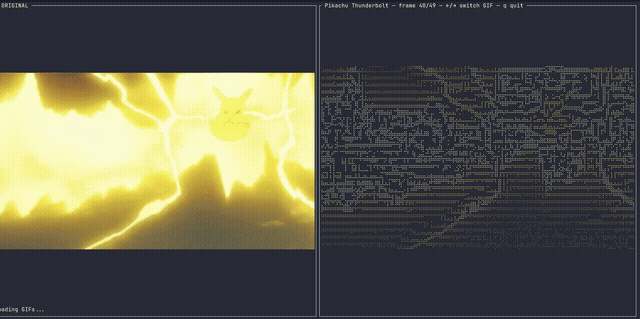

# ascii_test

Scratch prototypes validating the game's rendering style: colored Unicode braille
(2×4 dots per cell) as the sprite/battlefield medium. See `specs/13-rendering.md`
for how this feeds the real `render` crate.

## Demo

Left pane is the source GIF rendered at true color via the terminal's Kitty
graphics protocol; right pane is the same frames converted to colored braille —
the actual in-game rendering style.

## Binaries

All binaries read from hardcoded `/tmp/*` paths (scratch prototypes, not a CLI tool).

- **`main.rs`** (`cargo run --release --bin ascii_test`) — single-image fidelity
  comparison: ASCII ramp vs. half-block (raw/posterized) vs. braille, side by side.
  Reads `/tmp/lenna.png`, cropped to the face. Space cycles the right-pane mode.
- **`anim.rs`** (`cargo run --release --bin anim`) — animated GIF playback in
  braille, side by side with the true-color original via the Kitty graphics
  protocol. Reads whichever of `/tmp/pikachu_thunderbolt.gif`,
  `/tmp/pikachu_warmup.gif`, `/tmp/barbarian.gif` exist. ←/→ switches GIF, q quits.
- **`flow.rs`** (`cargo run --release --bin flow`) — multi-sprite depth-layer
  crowd ("tidal wave") compositing test. Reads `/tmp/barbarian.gif`.
- **`downrez.rs`** (`cargo run --release --bin downrez -- <image> [--width N] [--no-color]`) —
  standalone CLI: image → colored braille to stdout. The down-rezzer both other
  front-ends conceptually share.
- **`preview.sh <high_res.png> [battlefield.png]`** — prints both braille
  fidelities (creature-viewer detail vs. battlefield detail) for a source image,
  via `downrez`.
